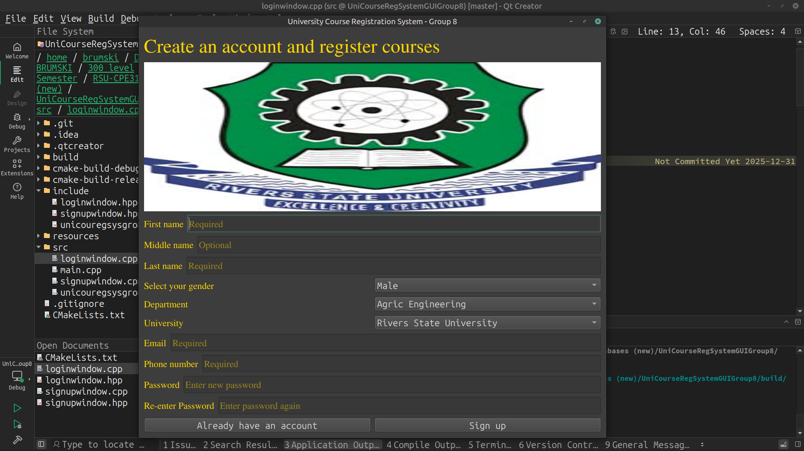

## University Course Registration System GUI

This project aims to make it easier for Rivers State University students to register their courses anywhere they are located.

---


---

*Prerequisites:*
+ C++20 Compiler
+ Cmake 3.30 and above
+ Terminal/Command Line

--- 

*Building and Running:*
```git clone --recursive-submodules git@github.com:lil-brumski/UniCourseRegSystemGUIGroup8.git```

## *OR*

```bash
git clone it@github.com:lil-brumski/UniCourseRegSystemGUIGroup8.git
cd UniCourseRegSystemGUIGroup8
git submodule update --init --recursive
```

Then

```bash
cd UniCourseRegSystemGUIGroup8
mkdir build
cd build
cmake .. 
cmake --build . --config Release
./UniCourseRegSystemGUIGroup8
```

---

# *Acknowledgements:*
This project uses the following Qt6 libraries:
+ Qt6::Core
+ Qt6::Widgets
+ Qt6::Gui

All under the GNU LGPL License
